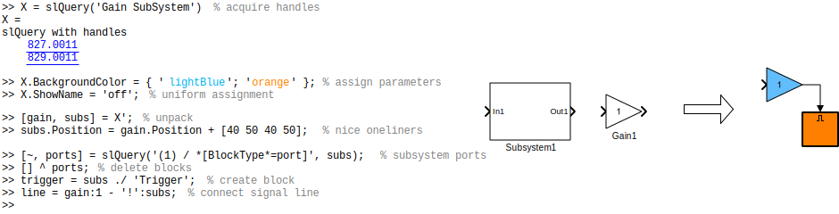

slQuery - the "easy-as-pie" API to Simulink
===========================================

`slQuery` is a "slickness-layer" ontop of the `find_system` and `get/set_param` API-functions 
and various related features of Simulink. It resulted from several inconveniences i had to deal 
with, while writing scripts that interact with and modify model structures.

`slQuery` brings you two major tools that make scripted interaction with models very easy and 
clean.

1. `slQuery` is a **query language** inspired by CSS/jQuery, XPath and regex that allows 
   searching a Simulink model for groups of blocks that satisfy certain conditions and 
   relations to each other.

2. `slQuery` wraps arrays of Simulink block handles into lightweight **"proxy objects"** that 
   can be used to access block parameters and structural features in a syntactically pleasing 
   way.

Have a look: This small example script shows how to interact with a model using `slQuery`. It 
acts on the two plain blocks given on the left side and step-by-step transforms them to become 
the Simulink logo on the right.




But this only the beginning! For a detailed description of what `slQuery` allows you to do, go 
to the [documentation and reference pages](doc/manual.md) section.

Installation
------------

`slQuery` is implemented as a crazily compact [single class 
file](https://github.com/arinar/slQuery/blob/master/slQuery.m), that you just put onto the 
MATLAB search path somewhere. You can download and install the script in your local scripts 
folder using the following command.

```matlab
websave(fullfile(uigetdir, '/slQuery.m'), 'https://raw.githubusercontent.com/arinar/slQuery/master/slQuery.m')
```

This will give you all the `slQuery`-features.

To also have the documentation and tests available locally, clone this repositiory or download 
the .zip and then use the `pathtool` command to add it to the MATLAB search path.

Bugs or Contributions
---------------------

Report bugs or missing features of `slQuery` as well as ideas or code via the [project page on 
github](https://github.com/arinar/slQuery).

Or contact me directly via robert with a circle-a then raschhour followed by the dotcom.

slQuery and TargetLink
----------------------

At my job, I've been working with the [dSPACE TargetLink production code 
generator](https://www.dspace.com/en/pub/home/products/sw/pcgs/targetli.cfm) a lot. `slQuery` 
is to a great extent the result of me recognizing and refining best practices and code patterns 
for an efficient automation of tedious modelling tasks. Scripting is often the only feasible 
way to handle systematic changes to our code generation basis models. The TargetLink block data 
API is in my opinion just as _not-slick_ as the Simulink API and so, more expressive means of 
interacting with this data were needed as well. Therefore TargetLink has a special place in 
`slQuery`'s heart.

Both the query language and proxy object magic do support access and manipulation of the 
TargetLink block data. This access is made possible via the special [`[tl.〈tab〉.〈prop〉=...]` 
parameters](doc/query-language.md#targetlink-block-properties) in the query and 
[`.tl.〈tab〉.〈prop〉` subscript syntax](doc/wrapper-objects.md#targetlink-block-properties) of 
the wrapper objects.

`slQuery`'s baby sister project [`ddQuery`](https://github.com/arinar/ddQuery) provides a 
similar tooling for the TargetLink Data Dictionary, which is oftentimes even more useful in 
this context.
