The slQuery Language
====================

The `slQuery` query language is used to search for patterns in Simulink models. As a language 
it is a mix between

* the _Select&Project_ aspect known from relational databases and SQL
* the XPath- and jQuery-style _navigation_ along a chain of element selectors coupled with

_Unlike SQL_ `slQuery` does not strictly separate the &pi; and &sigma; operations: there are no 
separate `SELECT ... FROM ...`- and `WHERE ...` clauses like SQL has them.

_Unlike XPath and jQuery/CSS_ `slQuery` returns all blocks that are part of the search pattern 
for each match. So the query string is not a _path_ leading to the final result set of objects, 
but rather a "pattern" that includes multiple objects in distinct roles. This aspect is very 
useful, because what you want to do with the last element in a path often depends on the data 
of objects earlier in the path and when you have them all available as a tuple, things are easy 
(this would definitely also be useful in XPath).

Any query statement is constructed from _selectors_ alternating with _combinators_. The query 
must begin with one selector and any number of combinator-selector pairs can follow.


```
query ::= selector [combinator selector ...]
```

Selectors describe a set of search criteria for finding single Simulink blocks. The blocks 
captured by a selector become one row in the query result. A match is only counted, if all 
constraining conditions defined by the combinators inbetween the selectors are also satisfied.

An Example
----------

Let's analyse a simple query:

```matlab
slQuery('SubSystem / Inport -> SubSystem -> Outport')
```

It consists of 4 very simple selectors:  `SubSystem`, `Inport`, `SubSystem` and `Outport`

The ammount and order of selectors defines the shape of the query result. Our return value will 
have 4 rows, with the 1st and 3rd row consisting of subsystem blocks and the 2nd and 4th of 
Inport and Outport blocks respectively.

In between the selectors go combinators, in our case (consequentially) 3 of them: `/`, `->` and `->`

The 1st one `/` specifies that any match for the 2nd selector (`Inport`) must be contained in 
the block matching the 1st selector (`Subsystem`) directly one level below. So far this query 
yields pairs of subsystems and input port blocks contained therein.

The 2nd combinator `->` specifies that the match for the 2nd block must be directly connected 
to the match of the 3rd row (another `SubSystem` block) with a signal line. Only direct line 
connections count here. Similarily, this 3rd block must be connected to the `Outport` blocks 
matching the 4th selector.

The whole query can be visualized as a model pattern like this:

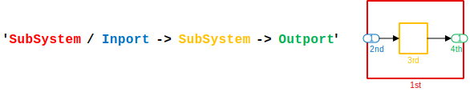

The following sections give an overview of all [selectors](#simple-selectors) and 
[combinators](#simple-combinators) and also example illustrations for each one.

Basic Selectors
---------------

&nbsp;&nbsp;&nbsp;&nbsp;&nbsp;&nbsp;&nbsp;&nbsp;&nbsp;&nbsp;&nbsp;&nbsp;&nbsp;&nbsp;&nbsp;&nbsp;Selector&nbsp;&amp;&nbsp;Syntax&nbsp;&nbsp;&nbsp;&nbsp;&nbsp;&nbsp;&nbsp;&nbsp;&nbsp;&nbsp;&nbsp;&nbsp;&nbsp;&nbsp;&nbsp;&nbsp; | &nbsp;&nbsp;&nbsp;&nbsp;&nbsp;&nbsp;&nbsp;&nbsp;&nbsp;&nbsp;&nbsp;&nbsp;&nbsp;&nbsp;&nbsp;&nbsp;&nbsp;&nbsp;&nbsp;&nbsp;&nbsp;&nbsp;&nbsp;&nbsp;Example&nbsp;&amp;&nbsp;Illustration&nbsp;&nbsp;&nbsp;&nbsp;&nbsp;&nbsp;&nbsp;&nbsp;&nbsp;&nbsp;&nbsp;&nbsp;&nbsp;&nbsp;&nbsp;&nbsp;&nbsp;&nbsp;&nbsp;&nbsp;&nbsp;&nbsp;&nbsp;&nbsp; | Notes
:-:|:-:|-
**any block** <br/> `slQuery('*')` | 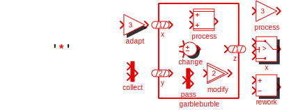 | match any block, subsystem or model root
**block type** <br/> `slQuery('〈block-type〉')` | 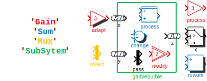 | Plainly stating a BlockType selects all blocks of that type. The block type selector is the simplest nontrivial selector
**block name** <br/> `slQuery('#〈block-name〉')`| 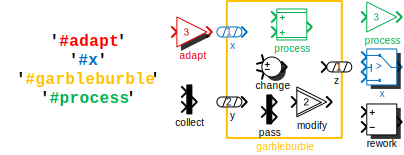 | Prefixing a name with a hash (`#`) selects on a specific block name.
**mask type** <br/> `slQuery('.〈mask-type〉')` | 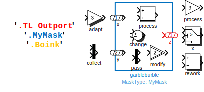 | MaskType selectors can be specified by prefixing the desired mask type with a period (`.`).
**parameter values** <br/> `slQuery('[〈param〉=〈value〉]')` <br/> `slQuery('[〈param〉="〈quoted〉"]')` | 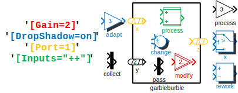 | A search can also be defined by specifying arbitrary block parameters in brackets. You can use double quotes (`"..."`) to search for non-simple strings (special chars, whitespace, ...).
more parameter values <br/> `slQuery('[〈param〉^=〈start〉]')` <br/> `slQuery('[〈param〉$=〈end〉]')` <br/> `slQuery('[〈param〉*=〈part〉]')` <br/> `slQuery('[〈param〉~=〈regex〉]')` | 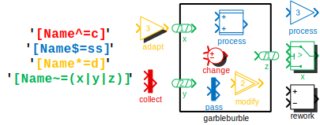 | There are also special forms of this to match partial strings at the start, end or anywhere or even use regular expressions
**flags** <br/> `slQuery('+〈flag-param〉')` | 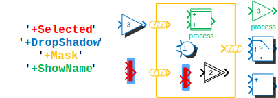 | the `+Flag`-notation is euqivalent to specifying `[Flag=on]`. This way, you can easily filter for any flag-parameter to be `'on'` - only one such flag is allowed though.
combinations | 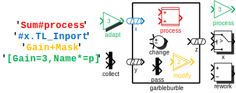 | all basic selectors can be combined to create more specific matching conditions. Multiple parameter specifications are separated by `,`.

The general form of a selector is this

```
'*〈block-type〉#〈block-name〉.〈mask-type〉[〈param1〉=〈value1〉,〈param2〉=〈value2〉,...]+〈flag〉'
```

Basic Combinators
-----------------

### Hierarchy

These combinators impose contraints on the hierarchical relationship between two blocks.

&nbsp;&nbsp;&nbsp;&nbsp;&nbsp;&nbsp;&nbsp;&nbsp;&nbsp;&nbsp;&nbsp;&nbsp;&nbsp;Combinator&nbsp;&amp;&nbsp;Syntax&nbsp;&nbsp;&nbsp;&nbsp;&nbsp;&nbsp;&nbsp;&nbsp;&nbsp;&nbsp;&nbsp;&nbsp;&nbsp; | &nbsp;&nbsp;&nbsp;&nbsp;&nbsp;&nbsp;&nbsp;&nbsp;&nbsp;&nbsp;&nbsp;&nbsp;&nbsp;&nbsp;&nbsp;&nbsp;&nbsp;&nbsp;&nbsp;&nbsp;&nbsp;&nbsp;&nbsp;&nbsp;Example&nbsp;&amp;&nbsp;Illustration&nbsp;&nbsp;&nbsp;&nbsp;&nbsp;&nbsp;&nbsp;&nbsp;&nbsp;&nbsp;&nbsp;&nbsp;&nbsp;&nbsp;&nbsp;&nbsp;&nbsp;&nbsp;&nbsp;&nbsp;&nbsp;&nbsp;&nbsp;&nbsp; | Notes
:-:|:-:|-
**parent** <br/> `slQuery('* / *')` <br/> or **child** <br/> `slQuery('* \ *')` | 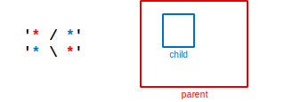 | The child block is directly inside a parent subsystem.
**descendant** <br/> `slQuery('* // *')` <br/> or **ancestor** <br/> `slQuery('* \\ *')` | 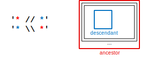 | There are weaker forms for arbitrary descendant and arbitrary ancestor. The descendant block is somewhere below the ancestor subsystem.
**sibling** <br/> `slQuery('* *')` | 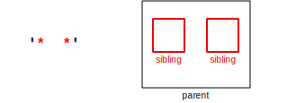 | Both blocks are in the same system but are not the same block. The combinator is written as just whitespace.

### Signals

These combinators are all about the signal connections between two blocks.

&nbsp;&nbsp;&nbsp;&nbsp;&nbsp;&nbsp;&nbsp;&nbsp;&nbsp;&nbsp;&nbsp;&nbsp;&nbsp;Combinator&nbsp;&amp;&nbsp;Syntax&nbsp;&nbsp;&nbsp;&nbsp;&nbsp;&nbsp;&nbsp;&nbsp;&nbsp;&nbsp;&nbsp;&nbsp;&nbsp; | &nbsp;&nbsp;&nbsp;&nbsp;&nbsp;&nbsp;&nbsp;&nbsp;&nbsp;&nbsp;&nbsp;&nbsp;&nbsp;&nbsp;&nbsp;&nbsp;&nbsp;&nbsp;&nbsp;&nbsp;&nbsp;&nbsp;&nbsp;&nbsp;Example&nbsp;&amp;&nbsp;Illustration&nbsp;&nbsp;&nbsp;&nbsp;&nbsp;&nbsp;&nbsp;&nbsp;&nbsp;&nbsp;&nbsp;&nbsp;&nbsp;&nbsp;&nbsp;&nbsp;&nbsp;&nbsp;&nbsp;&nbsp;&nbsp;&nbsp;&nbsp;&nbsp; | Notes
:-:|:-:|-
**signal line** <br/> `slQuery('* -> *')` <br/> `slQuery('* <- *')` | 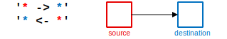 | The signal line combinators describe dataflow-dependency of the elements. The blocks must be directly connected with a signal flow line in the indicated direction: `->` is "feeding", `<-` is "fed by"
**signal flow** <br/> `slQuery('* ~> *')` <br/> `slQuery('* <~ *')` | 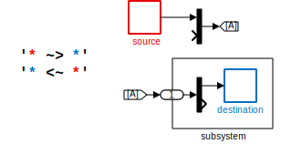 | This pair of combinators selects on logical data dependency rather than just explicit one-hop wiring in the model. It includes dependency across routing elements like Goto/From pairs, subsystem ports, Mux/Demux pairs, busses as well as some virtual blocks that don't change the value of a signal.
**downstream signal slice** <br/> `slQuery('* >> *')` | (*) | Data flow slicing can be used to restrict the search to the set of blocks that are dependent on an output signal of a "cause"-block.
**upstream signal slice** <br/> `slQuery('* << *')` | 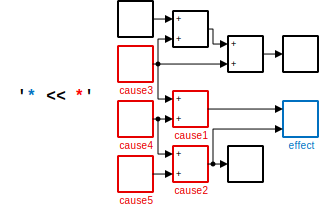(*)| To search for blocks, on which an input signal of an "effect" block depends, the reverse slicing combinator is the right choice.

(*) Despite the separate illustrations, the downstream and upstream slicing combinators are 
exact opposites just like the previous line and flow pairs.

### Physical Modelling Connections

A separate set of combinators is used for physical connection networks (Simscape).

&nbsp;&nbsp;&nbsp;&nbsp;&nbsp;&nbsp;&nbsp;&nbsp;&nbsp;&nbsp;&nbsp;&nbsp;&nbsp;Combinator&nbsp;&amp;&nbsp;Syntax&nbsp;&nbsp;&nbsp;&nbsp;&nbsp;&nbsp;&nbsp;&nbsp;&nbsp;&nbsp;&nbsp;&nbsp;&nbsp; | &nbsp;&nbsp;&nbsp;&nbsp;&nbsp;&nbsp;&nbsp;&nbsp;&nbsp;&nbsp;&nbsp;&nbsp;&nbsp;&nbsp;&nbsp;&nbsp;&nbsp;&nbsp;&nbsp;&nbsp;&nbsp;&nbsp;&nbsp;&nbsp;Example&nbsp;&amp;&nbsp;Illustration&nbsp;&nbsp;&nbsp;&nbsp;&nbsp;&nbsp;&nbsp;&nbsp;&nbsp;&nbsp;&nbsp;&nbsp;&nbsp;&nbsp;&nbsp;&nbsp;&nbsp;&nbsp;&nbsp;&nbsp;&nbsp;&nbsp;&nbsp;&nbsp; | Notes
:-:|:-:|-
**connection line** <br/> `slQuery('* - *')` | 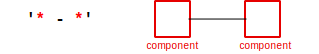 | Two blocks are directly connected with a physical connection line
**connection flow** <br/> `slQuery('* ~ *')` | 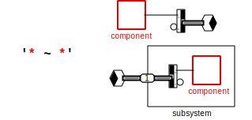 | Two blocks are connected logically including through virtual connection routing blocks
**connection slice** <br/> `slQuery('* <> *')` | 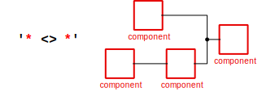 | Two blocks are in the same "patch" of a network of physical connections

### Miscellaneous

&nbsp;&nbsp;&nbsp;&nbsp;&nbsp;&nbsp;&nbsp;&nbsp;&nbsp;&nbsp;&nbsp;&nbsp;&nbsp;Combinator&nbsp;&amp;&nbsp;Syntax&nbsp;&nbsp;&nbsp;&nbsp;&nbsp;&nbsp;&nbsp;&nbsp;&nbsp;&nbsp;&nbsp;&nbsp;&nbsp; | &nbsp;&nbsp;&nbsp;&nbsp;&nbsp;&nbsp;&nbsp;&nbsp;&nbsp;&nbsp;&nbsp;&nbsp;&nbsp;&nbsp;&nbsp;&nbsp;&nbsp;&nbsp;&nbsp;&nbsp;&nbsp;&nbsp;&nbsp;&nbsp;Example&nbsp;&amp;&nbsp;Illustration&nbsp;&nbsp;&nbsp;&nbsp;&nbsp;&nbsp;&nbsp;&nbsp;&nbsp;&nbsp;&nbsp;&nbsp;&nbsp;&nbsp;&nbsp;&nbsp;&nbsp;&nbsp;&nbsp;&nbsp;&nbsp;&nbsp;&nbsp;&nbsp; | Notes
:-:|:-:|-
library **linked blocks** <br/> `slQuery('* § *')` <br/> or **linking blocks** <br/> `slQuery('* @ *')` | 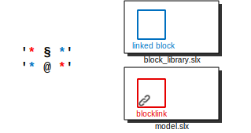 | the model block is linked to a block in a block library
**join** <br/> `slQuery('*, *')` | 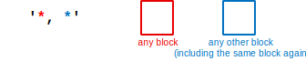 | Any two blocks satisfy this combinator. Used on its own, it essentially yields the cartesian product of the subqueries on the left and on the right.<br />It's useful in combination with [back-references](#back-references)

Port-Specifications in Signal & Connection Combinators
------------------------------------------------------

All signal or connection combinators can be extended by an optional _port specification_ at 
either end. The syntax for these is like this:

```
'*:〈port-spec〉 〈combinator〉 〈port-spec〉:*'
```

A port specification can be a number, a special symbol or a string. Its exact meaning depends 
on the type and direction of the combinator and also on the context.

Notice that the colon in `'block:〈sp〉 -> 〈dp〉:block'` visually binds the port specification to 
the block-selector (specifying a port _of_ the block), But the effect is best considered a 
property of the combinator (picky lines _attach only to certain_ ports). To make this point 
clear, perhaps read and write it like this: `'block :〈sp〉->〈dp〉: block'`.

<!-- (TODO: this isn't implemented) This mind-trick could also be used to solve the rare cases 
of ambiguity, where `* -> word:word -> *` can be either `* -> blocktype:portname -> *` or `* -> 
portname:blocktype -> *` - the missing whitespace around the combinator would tell `slQuery` to 
match it as a port specification.) -->

In the following sections, `->` and `<-` will be representative of all signal line combinator 
flavors of the same orientation (`->`, `~>`, `=>` `>>` and their mirror images) and likewise 
`-` symbolizes all connection line combinator flavors (`-`, `~`, `<>`).

### Signal Port specifiers (Inport and Outport)

For the classic directional signal lines (Simulink signals), the specification that appears on 
the "pointed-to"-end of the signal line combinator is the _destination port_ specification and 
the one on the "pointing-from"-end is the _source port_ specification.

```
'*:〈srcport-spec〉 -> 〈dstport-spec〉:*'
'*:〈dstport-spec〉 <- 〈srcport-spec〉:*'
```

&nbsp;&nbsp;&nbsp;&nbsp;Port&nbsp;Specification&nbsp;&amp;&nbsp;Syntax&nbsp;&nbsp;&nbsp;&nbsp; | &nbsp;&nbsp;&nbsp;&nbsp;&nbsp;&nbsp;&nbsp;&nbsp;&nbsp;&nbsp;&nbsp;&nbsp;&nbsp;&nbsp;&nbsp;&nbsp;&nbsp;&nbsp;&nbsp;&nbsp;&nbsp;&nbsp;&nbsp;&nbsp;Example&nbsp;&amp;&nbsp;Illustration&nbsp;&nbsp;&nbsp;&nbsp;&nbsp;&nbsp;&nbsp;&nbsp;&nbsp;&nbsp;&nbsp;&nbsp;&nbsp;&nbsp;&nbsp;&nbsp;&nbsp;&nbsp;&nbsp;&nbsp;&nbsp;&nbsp;&nbsp;&nbsp; | Notes
:-:|:-:|-
**source port number** <br/> `slQuery('*:〈onum〉 -> *')` <br/> `slQuery('* <- 〈onum〉:*')` | 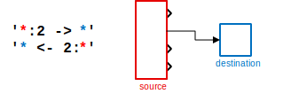 | Integers appearing as the source port spec of the combinator, specify the output port number of the adjacent source block.
**destination port number** <br/> `slQuery('* -> 〈inum〉:*')` <br/> `slQuery('*:〈inum〉 <- *')` | 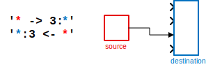 | Integers at the destination side, specify the input port number of the adjacent destination block.
**port name** <br/> `slQuery('*:〈name〉 <- *')` <br/> `slQuery('* -> 〈name〉:*')` <br/> `slQuery('*:〈name〉 -> *')` <br/> `slQuery('* <- 〈name〉:*')` | 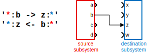 | String port specifications refer to the inport or outport connected to the input or output port block inside the subsystem.
**enable port** <br/> `slQuery('* -> ?:*')` <br/> `slQuery('*:? <- *')` | 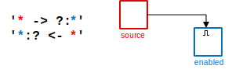 | The enable port is specified by `?` ("asking whether the block is even enabled")
**trigger port** <br/> `slQuery('* -> !:*')` <br/> `slQuery('*:! <- *')` |  | The trigger port is specified by `!` ("telling the block to do its work")
**ifaction port** <br/> `slQuery('* -> %:*')` <br/> `slQuery('*:% <- *')` |  | The ifaction port is specified by an `%` (i don't know, "deciding between options", maybe?)(1).
**reset port** <br/> `slQuery('* -> °:*')` <br/> `slQuery('*:° <- *')` |  | The reset port is specified by the degree symbol `°` (a superscript "zero").
**state readout port** <br/> `slQuery('*:^ -> *')` <br/> `slQuery('* <- ^:*')` | 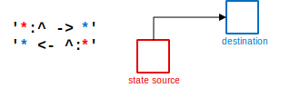 | The state readout port is specified with `^` (because this port is at the roof of the source block).

(1) this is the weakest mnemonic and the least logical choice for a symbol - can change in the future.

### Connection Line Port specifiers

https://www.mathworks.com/matlabcentral/answers/92190-how-can-i-find-and-work-with-physical-modeling-i-o-ports-of-a-subsystem-in-simulink

For undirectional lines of the physical modelling domain, the specification is just the 
_connection port_ specification.

```
'Block:〈connport-spec〉  - 〈connport-spec〉:Block'
```

&nbsp;Port&nbsp;Specification&nbsp;&amp;&nbsp;Syntax&nbsp; | &nbsp;&nbsp;&nbsp;&nbsp;&nbsp;&nbsp;&nbsp;&nbsp;&nbsp;&nbsp;&nbsp;&nbsp;&nbsp;&nbsp;&nbsp;&nbsp;&nbsp;&nbsp;&nbsp;&nbsp;&nbsp;&nbsp;&nbsp;&nbsp;Example&nbsp;&amp;&nbsp;Illustration&nbsp;&nbsp;&nbsp;&nbsp;&nbsp;&nbsp;&nbsp;&nbsp;&nbsp;&nbsp;&nbsp;&nbsp;&nbsp;&nbsp;&nbsp;&nbsp;&nbsp;&nbsp;&nbsp;&nbsp;&nbsp;&nbsp;&nbsp;&nbsp; | Notes
:-:|:-:|-
**RConn port** <br/> (natural/explicit) <br/> `slQuery('*:〈rcnum〉 - *')` <br/> `slQuery('* - 〈rcnum〉:r:*')` | 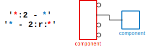 | Integers appearing as the right hand side connection port specifier or with an additional qualifier `:r:`, fix the outer RConn number of that line.
**LConn port** <br/> (natural/explicit) <br/> `slQuery('* - 〈lcnum〉:*')` <br/> `slQuery('*:l:〈lcnum〉 - *')` | 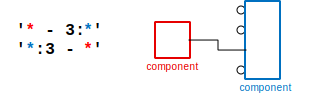 | LConn connections are done analogously: either at the left hand side or with the qualifier `:l:`.
**connection port** <br/> (internal numbering) <br/> `slQuery('*:i:〈inum〉 - *')` <br/> `slQuery('* - 〈inum〉:i:*')` | 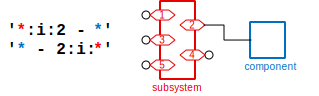 | The subsystem-internal numbering of connection ports (the number appearing on the PMIOPort block on the inside), can be invoked by the `:i:` qualifier. This works only with subsystems though.
**port name** <br/> `slQuery('*:〈name〉 - *')` <br/> `slQuery('* - 〈name〉:*')` | 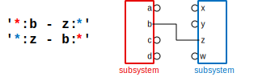 | String port specifications refer to the Connection Port, connected to the PMIOPort block inside the subsystem.

NOTE: the handling of port specs for connection lines is only partly implemented and the 
qualifier syntax needs some rework and smoothing over. Compared to the the straightforward 
colon operator semantics (imaginary numbers for connection lines and the colon operator side 
for LConn/RConn) this is already confusing (especially since the query syntax `'*:i:1 - *'` 
resembles the colon magic `X:1i` and they have _completely different_ meaning)

Back-References
---------------

In a valid query, the selectors and combinators must always alternate. Therefore, the 
combinators can only form linear chains between the selector matches and can only impose their 
constraints to the ones neighboring either side.

Back-references allow more freedom when applying a combinator. A back-reference `$〈refnum〉` acts 
like a type of selector, but

* it selects the same exact block as was already matched by the _〈refnum〉-th selector from 
  earlier_ in the query
* it does not yield the block as another row of the result again and
* it also doesn't increase the count used by 〈refnum〉 itself

In effect, you can insert arbitrary additional combinator-constraints between any two blocks in
the query. Instead of a chain of conditions, there can then be any network structure of them.

### Example

Let's again analyse an example query:

```matlab
slQuery('SubSystem / Inport -> Sum , $1 / Inport -> $3')
```

It has 4 actual selectors (`SubSystem`, 2x`Inport`, `Sum`) but also 2 back-references (`$1` and 
`$3`) so 6 "handles" in total and therefore 5 places for combinators to link them up. The first 
two `/` and `->` should be straigtforward. `,` then acts as a gap in the selector chain and 
imposes no actual constraints. A second `/` is placed after the reference `$1` and therefore 
the next selector must again be a child block of the first `SubSystem`. And according to the 
second `->` and the reference `$3`, this block must then also feed into the `Sum` block.

In summary, the entire _situation_ consists of a subsystem block, 2 input port blocks directly 
inside it and a `Sum` block, which must be directly fed from both these input port blocks. It 
could be visualized like this:

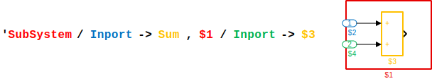

Nice and clear - but very deceptive as well! Let's actually run this query in a very simple 
model, which is hardly any more complex than the pattern above. It should therefore match the 
given section of this model exactly.

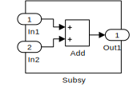

```matlab
>> slQuery('SubSystem / Inport -> Sum , $1 / Inport -> $3').name
ans =
  4x4 cell array
    {'Subsy'}    {'Subsy'}    {'Subsy'}    {'Subsy'}
    {'In1'  }    {'In2'  }    {'In1'  }    {'In2'  }
    {'Add'  }    {'Add'  }    {'Add'  }    {'Add'  }
    {'In1'  }    {'In1'  }    {'In2'  }    {'In2'  }
``` 

There are actually 4 distinct matches instead of only one! This is because there are 2 choices 
"In1" _and_ "In2" for each of the 2 `Inport` block selectors of the query, and either block 
satisfies all conditions of the query (because both are children of "Subsy" and both connected 
to "Add").

With some additional refinement, the intended result is achieved. 

1. Make the blocks `$2` and `$4` be siblings. This way, they will have the same parent (as
   before) but they cannot be the same block anymore.
2. break the symmetry, by specifying a target port condition for one of the signal line
   combinators. The respective selector can then only match one of the input port blocks.

```matlab
>> slQuery('SubSystem / Inport -> 1:Sum , $2 Inport -> $3').name
ans =
  4x1 cell array
    {'Subsy'}
    {'In1'  }
    {'Add'  }
    {'In2'  }
``` 

Back-references `$〈refnum〉` cannot be combined with other selector parts, because they are 
meant to only pick out the match from an earlier selector. If you want to apply additional 
conditions, you can just do so in the original selector.

Back-References in Parameter Selectors
--------------------------------------

Back-References can also be used for constructing the 〈value〉-side of a parameter selector. The 
syntax for this is

```
'* ... [〈param〉=$〈refnum〉.〈refparam〉]'
```

With this selector, the value of the 〈param〉-parameter of any candidate block must be equal to 
the value of the 〈refparam〉-parameter of an earlier block referenced by `$〈refnum〉`, as the 
syntax suggests.

The following example finds all pairs of Goto and From blocks that have the same GotoTag 
property

```matlab
slQuery('Goto, [GotoTag=$1.GotoTag]')
```

The special variants `^=`, `$=`, `*=` are also supported with this, nothing even is prohibiting 
the use of `~=`. But the latter would mean that the value of the 〈refparam〉-parameter needs to 
be a valid regular expression, which is most likely not commonly the case. But maybe, it could 
prove useful in certain workflows.


TargetLink Block Properties
---------------------------

The following special syntax allows filtering on the values of TargetLink properties in 
parameter selector pieces.

```
'[tl.〈dialogtab〉.〈property〉=〈value〉]'
```

These parameters work in the same way as normal ones, except they're based on `tl_get` instead 
of `get_param`. They do support all additional operator flavors (`^=`, `*=`, `$=`, `~=`) as 
well as back-references `'[tl.〈tab〉.〈prop〉=$〈refnum〉.tl.〈reftab〉.〈refprop〉]'` (both the 
specified parameter and the reference parameter).

Inputs to the Query
-------------------

There is one more trick up the `slQuery`-language's sleeve: Selectors can as their first piece
have a _candidate set index_ `(〈argnum〉)`

```matlab
slQuery('(1) ~> Gain', candidates)
slQuery('(1)#Name[Tag=special]', candidates)  % additional selector pieces to restrict candidates
slQuery('(1)[Tag=special]', slQuery('#Name')) % another query nested into the candidate
slQuery('(1) #Name[Tag=special]', candidates) % sibling combinator and new selector
```

This restricts, what a selector can match to one of the blocks given by an additional input 
argument. The candidate set argument can be a plain Simulink handle array, an `slQuery` result 
wrapper-array or a cellstr-array containing block pathes.

The array candidate set is embedded into the query as a flat candidate list, rather than 
multiple result rows.

NOTE: This formatstring-ish candidate-set feature is likely to be replaced by something a 
little cooler in the future: the possiibility to pass the query string as separate pieces to 
`slQuery`. The candidate set arguments would then go directly where they'd go as an argument 
index.

```matlab
slQuery(candidates) % simple conversion from handle or blockpathes-cellstr (is possible now)
slQuery(candidates, ' ~> Gain') % query string fragment continues with combinator
slQuery(candidates, '#Name.Type')  % additional selector pieces to restrict candidates
slQuery(slQuery('#Name'), '[Tag=special]') % another query nested into the candidate
slQuery(candidates, ' #Name.Type') % <-- sibling combinator and new selector
```

NOTE ALSO: the sibling combinator is likely to be changed from just whitespace to ` _ ` 
(surrounded by whitespace), since this will clarify all situations involving candidate sets. 
Input with selectors separated just by whitespace will then not parse.


