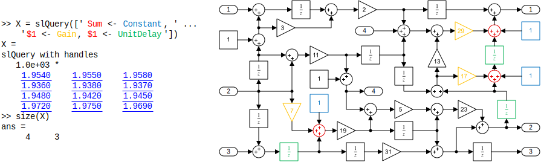
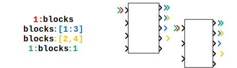
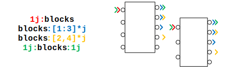
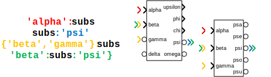
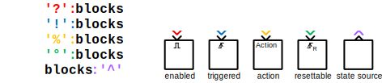

slQuery Wrapper Objects
=======================

The `slQuery` result objects are thin wrappers around an array of block handles. So thin in 
fact, that the `slQuery` class definition is just a straight derivative from `double` (the 
MATLAB type that all Simulink block handles have). The class does not introduce any members or 
other state and is not a handle class.

So every `slQuery` object is internally just a normal double array. The actual power and 
convenience comes from the many additional methods, or more specifically, from [operators for 
which MATLAB allows 
overloading](https://www.mathworks.com/help/matlab/matlab_oop/implementing-operators-for-your-class.html#br02znk-6). 
The most important ones are `subsref` & `subsasgn` responsible for the two subscript types

* **field access** `result.〈fieldname〉` used for accessing Simulink object parameters
* **array indexing**: `result(〈row_slice〉, 〈col_slice〉)` used mostly for the usual purposes

Lets get another thing out of the way first though: how to create the objects.


Wrapping Simulink Handles and Block Pathes
------------------------------------------

The main job of the `slQuery` class constructor is executing the [query 
strings](query-language.md) passed to it, and return a wrapper object representing the result 
of the corresponding search.

However it constructor can also be used to just convert existing handles to the

Result Shape & Indexing
-----------------------

Results from a query have one row for each block selector in the query string and one column 
for each finding of the corresponding block pattern in the searched model.



While the `slQuery` results are essentially just matrices of type double, the matrix indexing 
and transposition, differ slightly from the usual modes. By default, numeric indices apply to 
the row-dimension (the selectors from the query string) and logical indices (index-masks) to 
the column-dimension (distinct matches to the query pattern). This is done to facilitate even 
sleeker-looking code.

```matlab
>> X(1) % simple numeric index selects a single row of the result
ans = 
slQuery with handles
   1.0e+03 *
    1.9540    1.9550    1.9580
>> X(2:3) % a numeric range selects consecutive rows
slQuery with handles
   1.0e+03 *
    1.9360    1.9380    1.9370
    1.9480    1.9420    1.9450
>> X([1,4]) % a list of numeric indices selects just these rows
slQuery with handles
   1.0e+03 *
    1.9540    1.9550    1.9580
    1.9720    1.9750    1.9690
```

```matlab
>> X([true, false, true]) % logical array used as column-selection mask
    1.9540    1.9580
    1.9360    1.9370
    1.9480    1.9450
    1.9720    1.9690
```

Both indexing methods can be used together to formulate self-explanatory things like this:

```matlab
>> X( X(1).Orientation == "up" ) % only columns where 〈condition〉 is true
ans =
slQuery with handles
   1.0e+03 *
    1.9550    1.9580
    1.9380    1.9370
    1.9420    1.9450
    1.9750    1.9690
```

Result Disassembly / Dispersing
-------------------------------

The conjugate-transpose operator `'` is overwritten, so it can assign to multiple output 
variables. This way, the result array of matches can be easily disassembled into separate 
vectors with descriptive names. This also allows to discard rows of the result array that were 
important as a selector (i.e. for describing the pattern in the query), but aren't actually 
needed beyond that: simply assign these rows to `~` in the usual MATLAB way.

```matlab
>> [sums, consts, ~, delays] = slQuery('Sum <- Constant, $1 <- Gain, $1 <- UnitDelay')'
sums = 
slQuery with handles
    1.9540    1.9550    1.9580
consts =
slQuery with handles
    1.9360    1.9380    1.9370
delays =
slQuery with handles
    1.9720    1.9750    1.9690
```

Accessing Simulink Block Parameters
-----------------------------------

The fieldname subscript of `slQuery` objects is used to access block parameters of the result 
object.

When used as read-access it returns the property values of all blocks in the array as 
an array of the same shape.


```matlab
>> X = slQuery('Gain')
>> X.Gain
  1x11 cell array
    {'2'}    {'2'}    {'2'}    {'2'}    {'2'}    {'2'}    {'2'}    {'2'}    {'2'}    {'2'}    {'2'}
>> X = slQuery('Gain').Position
  1x11 cell array
rows 1 through 6
    {1x4 double}    {1x4 double}    {1x4 double}    {1x4 double}    {1x4 double}    {1x4 double}
rows 7 through 11
    {1x4 double}    {1x4 double}    {1x4 double}    {1x4 double}    {1x4 double}
```

While still in the `slQuery` subscript expression, you can further explor any structured 
parameter values. `slQuery` will extract the struct member or array element at each 
subscription stage and repack the results into an array again.

```matlab
>> slQuery('Gain').Position(1)
ans =
   300   165   360   175   220   415   465   265   465   460   340

>> slQuery('Sum[Inputs=+++]').PortHandles.Inport(2)
ans =
   1.0e+03 *
    2.2680    2.2890    2.1770    2.2260
```

Assignment to properties works in the same way although, it is a little more restricted.

```matlab
>> X = slQuery('Gain');
>> X.Gain = strsplit('2 3 5 7 11 13 17 19 23 29 31'); % bulk property assignment
>> X.BackgroundColor = 'lightBlue'; % homogeneous property assignment
>> X(3:6).BackgroundColor = 'green'; % assignment with subscript
>> X.Name = strcat('Amplify_By_', X.Gain); % vectorized property construction
```


Because of restrictions in the MATLAB language, you cannot write assignments in one statement 
with the query. Also, the assignment of structured properties isn't supported.

```matlab
xx slQuery('Gain').ForegroundColor = 'red';
error!
>> X = slQuery({bdroot})
X =
slQuery with handles
    0.0010
>> X.callbacks.PreShow = 'disp(''hellow'')'
error!
```

Additional Special-Properties
-----------------------------

In addition to all the normal block parameters, the following common properties or functions 
are also reachable with the `subsref` syntax.

Syntax | Notes
:-----:|:-----
**block path** <br/> `result.fullname` | The `.fullname`-parameter returns `getfullname(result.handle)`
**model root** <br/> `result.root` | The `.root`-parameter returns `bdroot(result.handle)`
**`slQuery`-object** <br/> `result.〈param〉.wrap` | When a paramter selection yields references to other Simulink objects (like a block path/handle or port handle) the additional `.wrap`-step packs the results into an `slQuery` object again. This only works while in the same statement as the parameter selection from an `slQuery` result.
**clickable links** <br/> `result.hyperlink` <br/> `result.hyperlink(〈names〉)` | the `.hyperlink`-parameter makes a link for each handle in the result. The link-text defaults to the block names, but an array of names can also be specified.

See these examples:

```matlab
>> X = slQuery('[LinkStatus=active]');
>> [X.hyperlink('block'); X.Parent.fullname; X.ReferenceBlock.root.hyperlink]'
  3x4 cell array
    {'block'        }    {'block'            }    {'block'       }    {'block'  }
    {'my_model/sys1'}    {'mymodel/sys2/sys3'}    {'mymodel/sys4'}    {'mymodel'}
    {'my_lib'       }    {'my_lib'           }    {'your_lib'    }    {'my_lib' }
```

TargetLink Block Properties
---------------------------

The special block parameter subscript `.tl` is the access point to all TargetLink block 
properties that are usually behind the `tl_get`/`tl_set` APIs. Subelements (the tabs and 
properties) are selected with additional `.〈name〉` subscript syntax.

```matlab
>> slQuery('.TL_Gain').tl.gain.type
ans = 
  1x5 cell array
    {'Int16'}    {'Int16'}    {'Float32'}    {'Int16'}    {'Float32'}
```

Also all settings of a tab or even the entire properties structure can be retrieved.

```matlab
>> gaintab = slQuery('.TL_Gain').tl.gain
gaintab =
  1x5 cell array
    {1x1 struct}    {1x1 struct}    {1x1 struct}    {1x1 struct}    {1x1 struct}

>> gaintab{1}.type
ans = 
    'Int16'

>> slQuery('.TL_Gain').tl
allprop =
  1x5 cell array
    {1x1 struct}    {1x1 struct}    {1x1 struct}    {1x1 struct}    {1x1 struct}

>> allprop{1}
ans = 
                comment: [1x1 struct]
                logdata: [1x1 struct]
                 output: [1x1 struct]
         multiplication: 1
         multiplication: [1x1 struct]
           blockcomment: 1
    hasrequirementinfos: 0
                   date: 7.3783e+05
```

The same works of course for setting TargetLink block properties:

```matlab
>> tl_blocks = slQuery('.TL_Gain')
slQuery with handles
   602.0001  619.0001  636.0001  653.0001  674.0001
>> tl_blocks.tl.gain.type = strcat('Uint', {'8', '16', '32', '16', '8'});
```

Lines and Ports
---------------

The colon operator `:` allows the retrieval of `slQuery` wrappers for the block port handles.

```
〈blocks〉:〈rhs-port-range〉
〈lhs-port-range〉:〈blocks〉
〈lhs-port-range〉:〈blocks〉:〈rhs-port-range〉
```

NOTE: this notation is highly experimental. Its usecases and general usefullness aren't very 
well established. It is there mainly because it so nicely reflects the query language port 
specifications and allows to do some cool things, when constructing models.

The following table shows the possibilities for what a port range can be

&nbsp;&nbsp;&nbsp;&nbsp;&nbsp;Port&nbsp;Type&nbsp;&amp;&nbsp;Syntax&nbsp;&nbsp;&nbsp;&nbsp;&nbsp; | &nbsp;&nbsp;&nbsp;&nbsp;&nbsp;&nbsp;&nbsp;&nbsp;&nbsp;&nbsp;&nbsp;&nbsp;&nbsp;&nbsp;&nbsp;&nbsp;&nbsp;&nbsp;&nbsp;&nbsp;&nbsp;&nbsp;&nbsp;&nbsp;Example&nbsp;&amp;&nbsp;Illustration&nbsp;&nbsp;&nbsp;&nbsp;&nbsp;&nbsp;&nbsp;&nbsp;&nbsp;&nbsp;&nbsp;&nbsp;&nbsp;&nbsp;&nbsp;&nbsp;&nbsp;&nbsp;&nbsp;&nbsp;&nbsp;&nbsp;&nbsp;&nbsp; | Notes
:-:|:-:|:-
**inport** <br/> `〈inport-range〉:blocks` <br/> **outport** <br/> `blocks:〈outport-range〉` |  | Use numeric indices to access signal ports (inport and outport number)
**LConn port** <br/> `〈lconn-range〉j:blocks` <br/> **RConn port** <br/> `blocks:〈rconn-range〉j` |  | Use imaginary unit to access connection ports (LConn and RConn number)
**by port name** <br/> `'〈name〉':subsystems` <br/> `subsystems:'〈name〉'` |  | signal and connection ports can be selected by the name of the corresponding port block on the inside. The side of the port spec isn't relevant in this case.
**enable** <br/> `'?':blocks` <br/> **trigger** <br/> `'!':blocks` <br/> **ifaction** <br/> `'%':blocks` <br/> **reset** <br/> `'°':blocks` <br/> **state readout** <br/> `blocks:'^'` |  | Symbols are used for the special port signals
**use both sides** <br/> `〈lhs〉:blocks:〈rhs〉` | | When both sides of the slice operator are present, the result is the horizontal concatenation of both sides.

